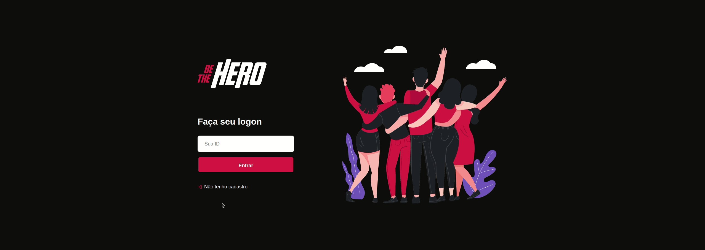
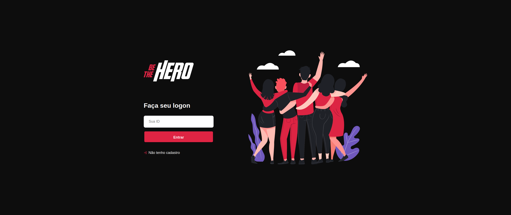
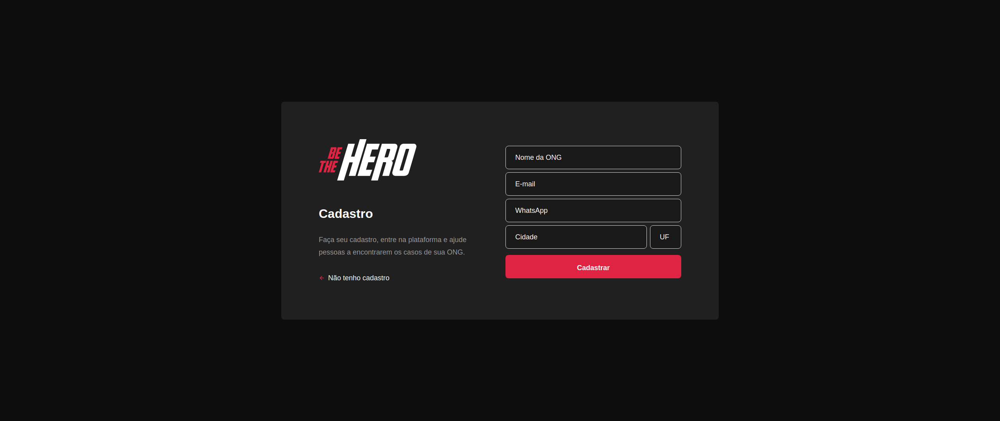
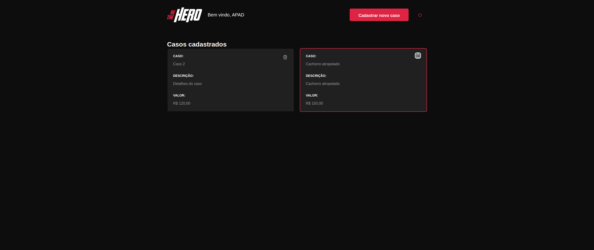
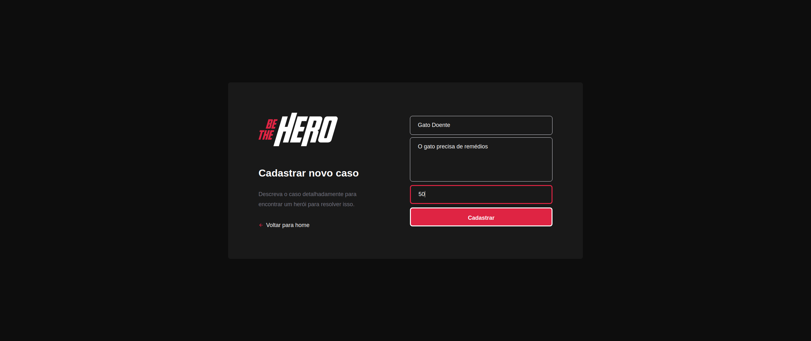

# Be-The-Hero
Aplicação com intuito de conectar pessoas interessadas em ajudar ONGS. Desenvolvida com Node.js, ReactJS e React Native.

# Back-end e Front-end Finalizados!

## :camera:

### Front-end

### Back-end:

## :rocket: Tecnologias

<table>
  <thead>
    <th>Back-end</th>
    <th>Front-end</th>
  </thead>
  <tbody>
    <tr>
      <td>Node.js</td>
      <td>ReactJS</td>
    </tr>
    <tr>
      <td>ExpressJs</td>
      <td>Styled-Components</td>
    </tr>
    <tr>
      <td>SqLite</td>
      <td>Axios</td>
    </tr>
    <tr>
      <td>Nodemon</td>
      <td>React Hooks</td>
    </tr>
    <tr>
      <td>Cors</td>
      <td>Eslint</td>
    </tr>
    <tr>
      <td>Knex</td>
      <td>Prettier</td>
    </tr>
  </tbody>
</table>

